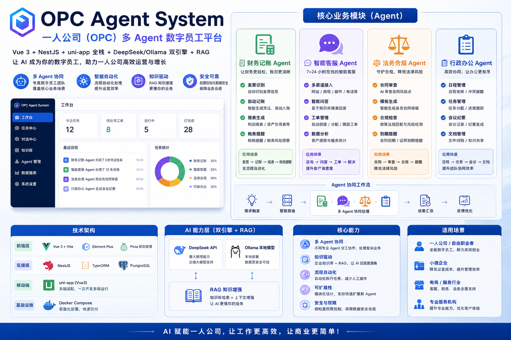

# OPC Agent System

> 一人有限责任公司（OPC）AI Agent 数字员工系统


## 技术栈

- **前端**: Vue 3 + Vite + Element Plus + Pinia
- **后端**: NestJS + TypeORM + PostgreSQL
- **移动端**: uni-app (Vue3)
- **AI**: DeepSeek API + Ollama 本地模型 + RAG
- **部署**: Docker Compose

## 项目结构

```
opc-agent-system/
├── packages/
│   ├── web/          # Web前端
│   ├── mobile/       # 移动端
│   └── server/       # 后端服务
├── docker-compose.yml
├── pnpm-workspace.yaml
└── package.json
```

## 快速开始

```bash
# 安装依赖
pnpm install

# 启动基础设施（PostgreSQL, Redis）
docker-compose up -d

# 初始化数据库并写入开发种子数据
pnpm db:migrate
pnpm db:seed

# 启动开发服务
pnpm dev
```

## 质量检查

```bash
pnpm build
pnpm test
pnpm lint
pnpm test:e2e
```

E2E 测试会创建并销毁独立的 `opc_agent_e2e` 数据库，需要本地 PostgreSQL 已启动。

## Agent 模块

| 模块 | 功能 |
|------|------|
| 财务记账 Agent | 发票识别、自动记账、报表生成、税务提醒 |
| 智能客服 Agent | 多渠道接入、智能问答、工单管理 |
| 法务合规 Agent | 合同审查、模板生成、合规检查 |
| 行政办公 Agent | 日程管理、任务管理、会议纪要 |
