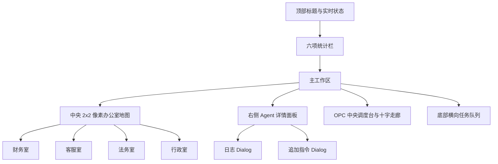

# OPC Agent 像素办公室 UI 规范

## 布局结构

主工作区采用地图和详情面板双栏结构。地图始终是主要视觉区域，详情面板承担业务信息和控制操作。小屏幕下详情面板移动到地图下方，地图保留横向滚动，避免压缩像素房间。

## 色彩方案

| 语义 | 色值 | 用途 |
| --- | --- | --- |
| 页面背景 | `#F5EFE6` | 整体暖米色画布 |
| 主色 | `#26372F` | 边框、标题、OPC 中控台 |
| 点缀色 | `#B7996E` | 走廊、辅助标签、阴影 |
| 卡片色 | `#FFF9F0` | SaaS 信息面板与任务气泡 |
| 深色文字 | `#1F2A24` | 标题与主要内容 |
| 辅助文字 | `#6E766F` | 描述、时间、次级信息 |
| running | `#4B8FCB` | 运行中状态 |
| waiting | `#D9A441` | 等待人工确认 |
| error | `#D66B52` | 异常与风险 |
| idle | `#4F8F68` | 空闲状态 |
| paused | `#89918C` | 暂停状态 |
| completed | `#26372F` | 已完成状态 |

## 像素元素规范

- 像素边框使用 `2px` 到 `4px` 实线和无圆角矩形。
- 像素阴影使用固定偏移，不使用模糊阴影作为主要轮廓。
- 地板采用 24px 棋盘格，墙面采用 18px 网格纹理。
- 角色由 SVG `rect` 拼成，动画使用 `steps()` 保持帧动画质感。
- 财务室包含账本、发票托盘和利润柱状图。
- 客服室包含聊天气泡墙、工单队列和耳机挂架。
- 法务室包含合同纸张、印章和风险标签。
- 行政室包含日历、待办清单和文件流转。
- 中央十字走廊承载任务流动点，OPC 控制台位于交叉中心。

## 交互逻辑

1. 点击房间更新 Pinia 中的 `selectedAgentId`，右侧详情同步切换。
2. 点击任务卡片自动选中该任务负责的 Agent。
3. 查看日志打开 Element Plus Dialog，展示当前 Agent 全量日志。
4. 追加指令先写入前端日志，再调用 command API；成功或失败均给出 Message 反馈。
5. 暂停任务保存原状态并切换为 `paused`，状态灯和按钮文案同步变化。
6. 继续任务恢复暂停前状态，并追加系统日志。
7. 重新运行将 Agent 和未完成任务进度重置为 5%，追加任务日志。
8. 页面提供加载遮罩、错误 Alert、日志和任务空状态。
